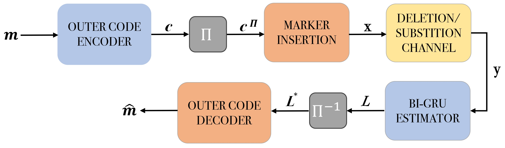
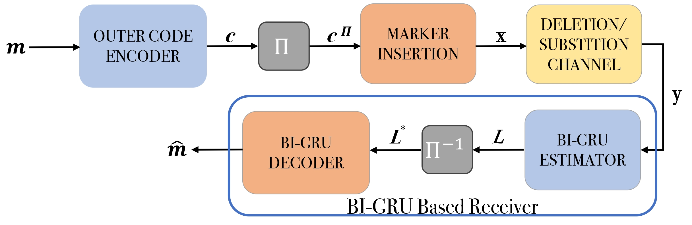

# Introduction
This is the GitHub repository for the paper "A Deep Learning-Based Decoder for Concatenated Coding over Deletion 
Channels," which has been accepted for presentation at the IEEE International Conference on Communications 
in June 2024. The paper is authored by E. Uras Kargı and Tolga M. Duman.

This paper introduces a deep learning-based decoder designed for concatenated coding 
schemes over a deletion/substitution channel. Specifically, we focus on serially
concatenated codes, where the outer code is either a convolutional or a low-density 
parity-check (LDPC) code, and the inner code is a marker code. We utilize Bidirectional 
Gated Recurrent Units (BI-GRUs) as log-likelihood ratio (LLR) estimators and outer code decoders 
for estimating the message bits. Our results indicate that decoders powered by BI-GRUs perform comparably in terms of error rates 
with the MAP detection of the marker code. We also find that a single network can work 
well for a wide range of channel parameters. In addition, it is possible to use a single 
BI-GRU based network to estimate the message bits via one-shot decoding when the outer code is a
convolutional code.

# Details

We consider two different setups. In the first setup, we have
a serial concatenation of an LDPC (or a convolutional code)
with a marker code, and a BI-GRU architecture is developed
to estimate the LLRs of the bits input to the marker code.
Fig. 1 illustrates the block diagram of the first setup. In
the second setup, we focus on the serial concatenation of
a convolutional code with a marker code and develop BI-
GRU architectures that perform one-shot decoding. That is,
two BI-GRU architectures are combined to estimate the LLRs
and decode the message bits in one step. Fig. 2 depicts the
block diagram of the second setup, where the entire receiver
is replaced by BI-GRU architectures.

Figure 1: Block diagram for the first setup.

)Figure 2: Block diagram for the second setup where the entire decoder is replaced by BI-GRU architectures.


## Training

Run the script python training.py to train the network. You can start training with the following command line:


```bash
python main.py --workdir=$WORKING_DIRECTORY --vocab_filepath=$VOCAB_FILE_PATH --config=$CONFIGURATION_FILE_PATH

```

## Test
Run the script python3 test.py to test the performance of decoders. You can choose the following approaches. 

## Test the BI-GRU based decoders

```

## Test baseline approaches


## License

[MIT](https://choosealicense.com/licenses/mit/)
